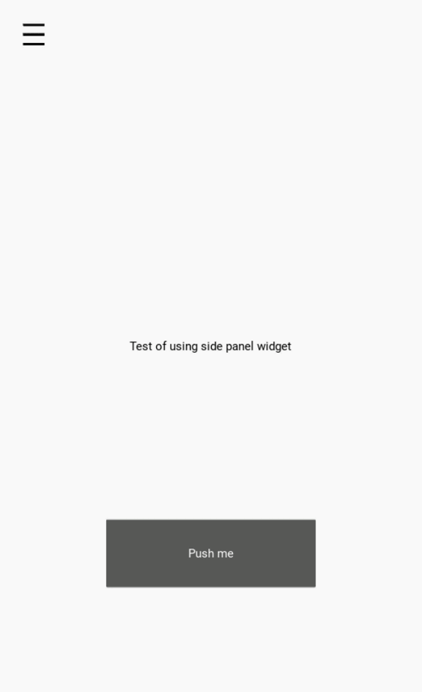

# SidePanelKivy-KivyMD
Side panel animated widget for kivy project

For using this widget you need to add it as the last widget and you need to use a screen manager widget as app root widget. Check my example code to understand what i mean.

</img>
